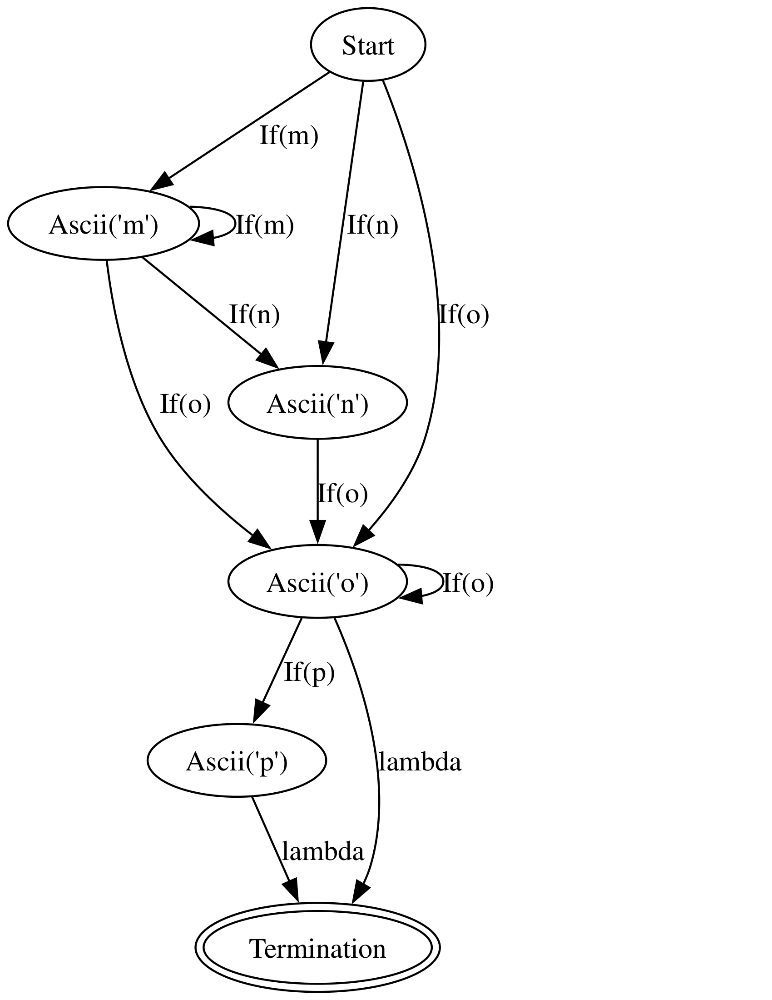

# Regex_FSM

## Задача лабораторної роботи
Написати модуль, який зможе обробляти прості регулярні виразі, з токенів Ascii, ., * та +. Додатково імплементація regex character classes (наприклад [a-z0-9]) та ?.

## Ідея

Моя ідея це створити недетермінований скінченний автомат, який буде ,читаючи стрічку, змінювати стани. Я розділив regex токени на necessary(Ascii, ., + та character classes) та unnecessary(*, ?) і за допомогою даних про те, який токен я отримав на вхід і який токен мав перед тим я буду вирішувати, які зв'язки добавляти.

## Імплементація

### RegexFSM

#### Ініціалізація
Для ініціалізації потрібно задати валідний regex вираз(допустимими є символи: Ascii, *, +, ., ? та символьний клас [...], у якому є підтримка заперечення.

#### Токени
За замовчуванням у кожної FSM є StartState, який є necessary і при ітерації по токенами викликається ініціалізація наступного стану, але спершу про самі токени. Після імплементації символьних класів довелося не просто сприймати кожен символ стрічки як окремий токен, а перед тим перетворювати стрічку у токени, це відбувається у get_tokens_from_pattern ну і відповідно у стані символьного класу є метод, який дістає зі стрічки вигляду [....] всі доступні символи.

#### Стани
StartState - ніяких особливих властивостей, окрім того, що він має завжди self.curr атрибут кожної FSM має бути StartState

AsciiState - стан, який зберігає у собі символ Ascii, і дозволяє перехід у себе лише, якщо next_char == self.symbol.

DotState - стан, який дозволяє перехід у себе за рахунок будь-якого символу.

CharacterBracketClassState - стан, який зберігає у собі regex character class, дозволяє перехід у себе лише, якщо next_char є у self.symbols.

TerminationState - заключний стан, який дозволяє вхід будь-кому(check_self завжди true), ідея у тому, що після того, як токени закінчилися ми приєднюємо всі попередні стани(list) нібито лямбда шляхом до нього, і сприймаємо сам термінаційний стан лише як вказівник, що попередній стан є заключним. Тому в кінці зчитування стрічки перевіряється чи у якогось з станів, у яких знаходиться недермінований скінченний автомат після зчитування, у наступних станах є TerminationState.( так TerminationState не є заключним станом, а лише вказівником)

#### Додавання наступного стану
Функція приймає на вхід токен, який ми считали, список попередніх станів(список, тому що деколи є декілька попередніх станів через опціональність деяких токенів), останній створений стан та необхідність попереднього стану(true/false). А повертає новий стан і список нових попередніх станів

Алгоритм додавання наступного стану такий:

1) Метчимо токен і приймаємо наступні дії:
  - 1.1 Якщо токен це ., буква(тобто Ascii) або символьний клас тоді ми створюємо відповідний стан, якщо попередній символ був necessary тоді кажемо, що новими попередніми буде останньо створений стан(last_created_state). І кажемо, що цей токен обов'язковий(necessary=True)
  - 1.2 Якщо токен це "*", тоді ми додаємо петлю на попередній стан (останній створений стан додається до своїх же наступників), а також створюємо "обхідний шлях", додаючи останній стан до списку попередніх станів. Цей токен необов'язковий (necessary=False).

  - 1.3 Якщо токен це "+", тоді якщо попередній токен був обов'язковий, додаємо петлю на попередній стан (останній створений стан додається до своїх же наступників), і встановлюємо новими попередніми станами лише останній створений стан. В іншому випадку, нові попередні стани залишаються незмінними. Токен необов'язковий (necessary=False).

  - 1.4 Якщо токен це "?", тоді якщо попередній токен був обов'язковий, додаємо останній створений стан до списку попередніх станів (створюючи "обхідний шлях"). Таким чином, новий список попередніх станів включає і попередні, і останній створений. Токен необов'язковий (necessary=False).

  - 1.5 Якщо токен це TERMINATION (спеціальний токен, що означає кінець шаблону), створюємо термінальний стан, який вказує на те, що попередні стани є заключними.

Якщо токен обов'язковий (necessary=True), тоді для кожного стану зі списку попередніх додаємо новий стан до списку його наступників.

### Перевірка відповідності рядка шаблону
Метод check_string перевіряє, чи відповідає вхідний рядок заданому шаблону:

  1) Починаємо з початкового стану (curr_state)

  2) Для кожного символу рядка:
  - Для кожного активного стану знаходимо всі можливі переходи при поточному символі
  - Оновлюємо список активних станів

  3) Перевіряємо, чи є серед кінцевих станів хоча б один термінальний

### Візуалізація автомата
Метод to_dot_file створює DOT-представлення автомата для візуалізації:

1) Для кожного стану створюється вузол з відповідною міткою
2) Термінальні стани позначаються подвійним контуром
3) Переходи між станами відображаються ребрами з мітками умов переходу

Цей метод повертає стрічку, яку можна просто записати у файл.

Наприклад для виразу "m*n?o+p?" буде ось такий автомат:
